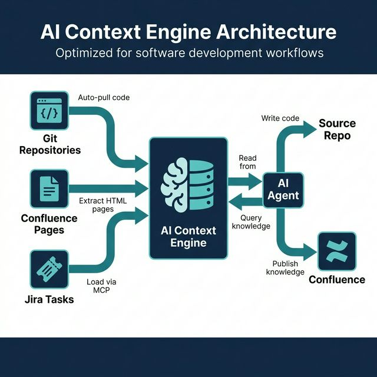

# 🏗️ Setup Guide — Global (Master Architect)

> You are the Lead / Architect. You define the system-wide rules that all teams must follow.



---

## Prerequisites

- [ ] Node.js ≥ 18 installed
- [ ] A Git repository for the main project
- [ ] Access to your company's Confluence workspace
- [ ] Jira project created
- [ ] AI Context Engine configured (by your DevOps/Infra team)

---

## Step-by-Step Setup

### 1. Navigate to your main project root

```bash
cd ~/projects/my-main-project
```

### 2. Run the CLI

```bash
npx init-antigravity-workflow-context-engine
```

### 3. Answer the prompts

| Prompt | What to enter | Example |
|--------|---------------|---------|
| **Select your role** | `Global (Master Architect)` | — |
| **Select framework** | Your main framework | `Flutter (Dart)` |
| **Enter PREFIX** | Short project identifier | `BTRACK` |
| **Jira project key** | Your Jira project key | `CB` |
| **Confluence Space IDs** | Space IDs (comma-separated) | `BTRACK,BTRACK-ARCH` |
| **Git repo URLs** | Repos indexed by Context Engine | `https://github.com/company/main-app.git` |
| **Select AI agent** | Your AI agent tool | `Antigravity (Gemini)` |
| **Overwrite?** | Usually `No` for first run | `No` |

### 4. Verify generated files

```
my-main-project/
├── .aiignore                              ✅ Created
├── .agentrules                            ✅ Created
└── .antigravity/
    ├── 00_BTRACK_Agent_Workflow.md         ✅ Constitution
    └── 00_Core_Routing.md                 ✅ Full Access routing
```

### 5. Generate Architecture Map

Copy the prompt shown by the CLI and paste it into your AI agent. It will:
1. Scan your entire codebase
2. Generate `.antigravity/BTRACK_Architecture_Map.md`
3. Create a Confluence page: `[Global-Convention] Master_Architecture`

### 6. Create convention pages in Confluence

This is the **most important step** — you define the rules everyone follows:

```
Confluence Pages to Create:
├── [Global-Convention] Master_Architecture.md      ← from step 5
├── [Global-Convention] Clean_Architecture_Rules.md  ← write manually
├── [Global-Convention] UI_Theme_Standards.md        ← write manually
├── [Global-Convention] Git_Flow_Rules.md            ← write manually
├── [Global-Convention] API_Design_Standards.md      ← write manually
└── [Global-ADR] ADR-001_State_Management.md         ← write when decisions are made
```

> **💡 Tip:** The AI Context Engine will automatically index these pages. All module agents will inherit your rules without any manual action.

### 7. Commit and push

```bash
git add .aiignore .agentrules .antigravity/
git commit -m "chore: init antigravity workflow (Global)"
git push
```

---

## What Happens Next?

- When any developer (or AI agent) starts a task, they follow the **4-Round Wizard**
- The agent reads your Convention pages from the Context Engine before writing any code
- Your Architecture Map guides the agent to understand the codebase structure

---

## Checklist After Setup

- [ ] Architecture Map generated and published to Confluence
- [ ] At least 3 Convention pages created in Confluence
- [ ] `.antigravity/` committed and pushed to Git
- [ ] AI Context Engine is indexing your Confluence space and Git repo
- [ ] Your team knows to run `npx init-antigravity-workflow-context-engine` with **Module** mode for sub-packages
