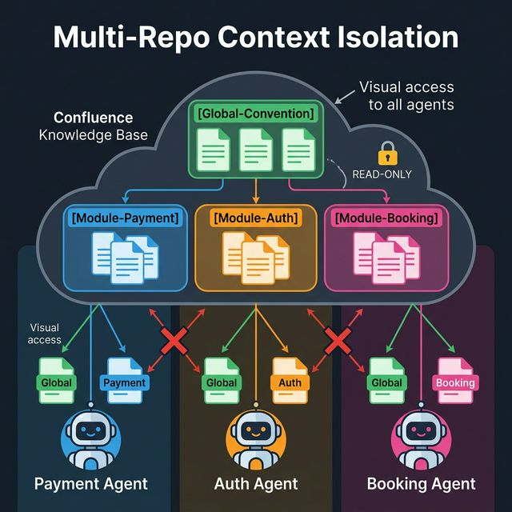

# 📦 Setup Guide — Module (Module Owner)

> You are a Module Owner / Team Lead. You own one specific part of the system.



---

## Prerequisites

- [ ] Node.js ≥ 18 installed
- [ ] The **Master Architect** has already set up the Global project
- [ ] Global Convention pages exist in Confluence
- [ ] Your module has its own Git repository (or sub-directory)
- [ ] You know your Confluence Space ID

---

## Step-by-Step Setup

### 1. Navigate to your module root

```bash
cd ~/projects/payment-service
```

### 2. Run the CLI

```bash
npx init-antigravity-workflow-context-engine
```

### 3. Answer the prompts

| Prompt | What to enter | Example |
|--------|---------------|---------|
| **Select your role** | `Module (Module Owner)` | — |
| **Module name** | Your module name | `Payment` |
| **Select framework** | Your framework | `Flutter (Dart)` |
| **Enter PREFIX** | Same as main project | `MYAPP` |
| **Jira project key** | Your Jira key | `MYAPP` |
| **Confluence Space IDs** | Same shared space | `MYAPP` |
| **Git repo URLs** | Your module repo | `https://github.com/company/payment-service.git` |
| **Dependencies** | Modules you depend on | `Auth,Core` |
| **Select AI agent** | Your AI agent | `Antigravity (Gemini)` |

### 4. Auto-detect dependencies (Flutter projects)

If your project is Flutter, the CLI auto-detects path dependencies from `pubspec.yaml`:

```yaml
# pubspec.yaml
dependencies:
  auth_module:
    path: ../auth-module
  core_module:
    path: ../core-module
```

The CLI will ask: *"Use detected dependencies as READ-ONLY modules? (auth_module, core_module)"*

### 5. Verify generated files

```
payment-service/
├── .aiignore                              ✅ Created
├── .agentrules                            ✅ Created
└── .antigravity/
    ├── 00_MYAPP_Agent_Workflow.md          ✅ Constitution (scoped)
    └── 00_Core_Routing.md                 ✅ Scoped routing
```

### 6. Check your routing rules

Open `00_Core_Routing.md` and verify:

```markdown
## What You CAN Access
- ✅ [Global-Convention] — system-wide rules
- ✅ [Module-Payment] — your module's docs
- ✅ [Module-Auth] — dependency (READ-ONLY)
- ✅ [Module-Core] — dependency (READ-ONLY)

## What You CANNOT Access
- ❌ [Module-Booking] — not your dependency
- ❌ [Module-Notification] — not your dependency
```

### 7. Generate Module Architecture Map

Paste the CLI prompt into your AI agent. It will:
1. Scan your module's codebase
2. Generate `.antigravity/MYAPP_Payment_Architecture_Map.md`
3. Create a Confluence page: `[Module-Payment] Architecture_Map`

### 8. Create module-specific pages in Confluence

```
Confluence Pages to Create:
├── [Module-Payment] Architecture_Map.md        ← from step 7
├── [Module-Payment] Convention_API_Design.md   ← your API patterns
├── [Module-Payment] Convention_Error_Handling.md ← your error standards
└── [Module-Payment] ADR-001_Gateway_Choice.md  ← your decisions
```

### 9. Commit and push

```bash
git add .aiignore .agentrules .antigravity/
git commit -m "chore: init antigravity workflow (Module: Payment)"
git push
```

---

## Context Isolation in Practice

Your AI agent is **sandboxed**:

```
✅ Can read:
   • [Global-Convention] Clean_Architecture_Rules    ← from Architect
   • [Module-Payment] Convention_API_Design          ← your own
   • [Module-Auth] Convention_JWT_Flow               ← dependency (READ-ONLY)

❌ Cannot read:
   • [Module-Booking] Convention_Room_Booking        ← blocked
   • [Module-Notification] Push_Strategy             ← blocked

✅ Can write:
   • [Module-Payment] *                              ← your own pages

❌ Cannot write:
   • [Global-Convention] *                           ← only Architect
   • [Module-Auth] *                                 ← not yours
```

This prevents your agent from hallucinating based on unrelated module knowledge.

---

## Checklist After Setup

- [ ] Module Architecture Map generated and published to Confluence
- [ ] Module convention pages created in Confluence
- [ ] Dependencies declared correctly in `00_Core_Routing.md`
- [ ] `.antigravity/` committed and pushed to Git
- [ ] Tested: AI agent can read Global + your module docs (not others)
