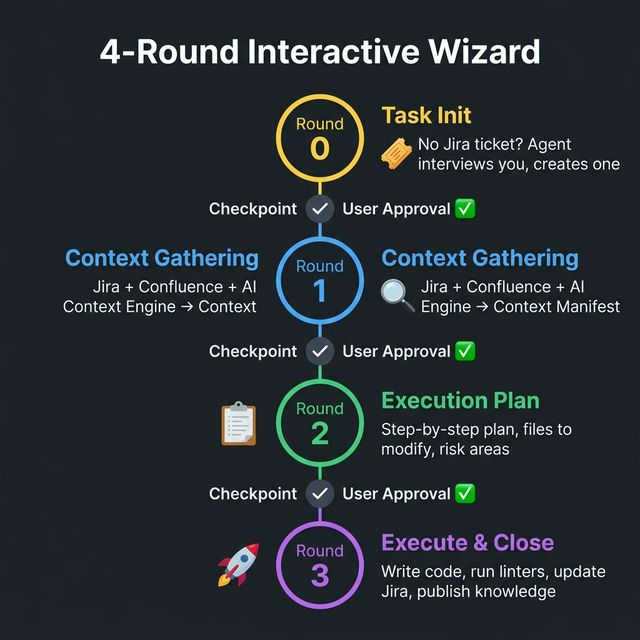

# ✨ Real-World Walkthrough — Build a New Feature

> Step-by-step example of using the 4-Round Wizard to build a new feature.



---

## Scenario

**Feature Request:** "Add QR code check-in for meeting room bookings. When a user arrives at the room, they scan a QR code on the room's door to confirm attendance."

**Module:** Booking (Flutter)  
**Jira Ticket:** `CB-200` (already created by PM)

---

## Round 0 — Skipped ✅

> Ticket already exists → Jump directly to Round 1.

---

## Round 1 — Context Gathering

### You say:
```
CB-200 — Add QR check-in for meeting rooms
```

### Agent reads from 3 sources:

**Jira MCP →**
```
CB-200: QR Code Check-in for Meeting Rooms
Type: Feature
Status: To Do
Acceptance Criteria:
  - User scans QR code on room door
  - System validates booking exists for current time
  - Mark attendance as "checked_in"
  - Show confirmation screen with room details
```

**Confluence MCP →**
```
PRD: "Meeting Room QR Check-in v1"
  - QR format: URL → https://app.company.com/rooms/{room_id}/checkin
  - API endpoint: POST /api/rooms/{room_id}/checkin
  - Response: { status, booking_id, room_name, time_slot }
  
API Contract v3:
  - POST /api/rooms/{room_id}/checkin
  - Headers: Authorization: Bearer {token}
  - Body: { booking_id: string }
  - Response: 200 { checked_in: true, booking: {...} }
  - Error: 404 "No active booking found"
```

**AI Context Engine →**
```
[Convention] Clean Architecture:
  - Feature structure: data/ domain/ presentation/
  - Use BLoC for state management
  - Repository pattern for API calls

[Convention] API Design:
  - All POST requests return standardized response envelope
  - Error handling: ApiException → Failure → BLoC error state

[Module-Booking] Architecture Map:
  - Existing: BookingBloc, BookingRepository, BookingUseCases
  - Route: /booking/* handled by BookingRouter

Codebase scan:
  - QR scanning: no existing implementation
  - Camera permission: already configured in AndroidManifest + Info.plist
  - deep_link_handler.dart: handles URL schemes
```

### Agent builds Context Manifest and asks for approval:

```yaml
task_info:
  id: "CB-200"
  type: "new_feature"
  scope: "Mobile-Flutter"

context_sources:
  - priority: 1
    source: "Confluence"
    finding: "PRD defines QR format, API contract for checkin endpoint"
  - priority: 2
    source: "AI Context Engine"
    finding: "[Convention] Clean Architecture — BLoC + Repository pattern"
  - priority: 3
    source: "AI Context Engine"
    finding: "Camera permission already configured, no existing QR scanner"
  - priority: 4
    source: "AI Context Engine"
    finding: "deep_link_handler.dart can be extended for QR URLs"
```

### You approve ✅

---

## Round 2 — Execution Plan

### Agent generates plan:

```
📋 Execution Plan for CB-200:

New package needed:
  • mobile_scanner (QR code scanning)

Files to CREATE (8 files):
  1. lib/features/booking/domain/usecases/checkin_usecase.dart
  2. lib/features/booking/data/repositories/checkin_repository_impl.dart
  3. lib/features/booking/presentation/bloc/checkin_bloc.dart
  4. lib/features/booking/presentation/bloc/checkin_event.dart
  5. lib/features/booking/presentation/bloc/checkin_state.dart
  6. lib/features/booking/presentation/pages/qr_scanner_page.dart
  7. lib/features/booking/presentation/pages/checkin_success_page.dart
  8. lib/features/booking/presentation/widgets/qr_overlay_widget.dart

Files to MODIFY (2 files):
  9. lib/features/booking/presentation/router/booking_router.dart
     → Add /booking/qr-checkin route
  10. lib/core/deep_link_handler.dart
     → Handle rooms/{id}/checkin URL from QR code

Convention compliance:
  ✅ BLoC pattern for state management
  ✅ Repository pattern for API calls
  ✅ Clean Architecture folder structure
  ✅ API error handling via ApiException → Failure

Risk areas:
  ⚠️ Camera permission — already configured but needs runtime check
  ⚠️ QR scanning — first time using mobile_scanner package

Estimated effort: 2–3 hours

"Do you approve this execution plan?"
```

### You review, request a change:
```
Add a timeout — if user doesn't scan within 60 seconds, show a retry prompt.
```

### Agent updates plan, you approve ✅

---

## Round 3 — Execution & Closure

### Agent executes step by step:

**Step 1:** Add package
```bash
flutter pub add mobile_scanner
```

**Step 2–8:** Create all 8 new files following conventions

**Step 9–10:** Modify router and deep link handler

**Step 11:** Run linter
```bash
$ flutter analyze
No issues found! ✅
```

### Agent updates Jira progressively:

```yaml
execution_status:
  current_round: "3"
  round_status: "in_progress"
  last_action: "Created QR scanner page with 60s timeout"
  timestamp: "2026-04-02 17:30"
  completed_steps:
    - "✅ Round 1: Context gathered, PRD + API contract found"
    - "✅ Round 2: Plan approved with timeout addition"
    - "🔄 Round 3: 8/10 files done"
```

### After completion:

```yaml
execution_status:
  current_round: "done"
  round_status: "approved"
  completed_steps:
    - "✅ Round 1: Context gathered"
    - "✅ Round 2: Plan approved (10 files)"
    - "✅ Round 3: All files created, linter passes"
```

### Knowledge Closure:

Agent creates Confluence page:
```
[Module-Booking] ADR-002_QR_Checkin_Implementation

Decision: Use mobile_scanner package for QR scanning
Context: Need camera-based QR scanning for room check-in
Alternatives considered:
  - qr_code_scanner: deprecated
  - flutter_barcode_scanner: less maintained
  - mobile_scanner: Google MLKit, actively maintained ✅
Consequences:
  - Adds ~2MB to app size
  - Requires camera permission (already configured)
```

---

## Summary

| Phase | Duration | What happened |
|-------|----------|--------------|
| Round 1 | 5 min | Context from Jira + Confluence + Context Engine |
| Round 2 | 10 min | Plan generated, you added timeout requirement |
| Round 3 | 2.5 hrs | 10 files created/modified, tested |
| Closure | 5 min | ADR published to Confluence |

**Total: ~3 hours** for a complete feature with architecture documentation.
